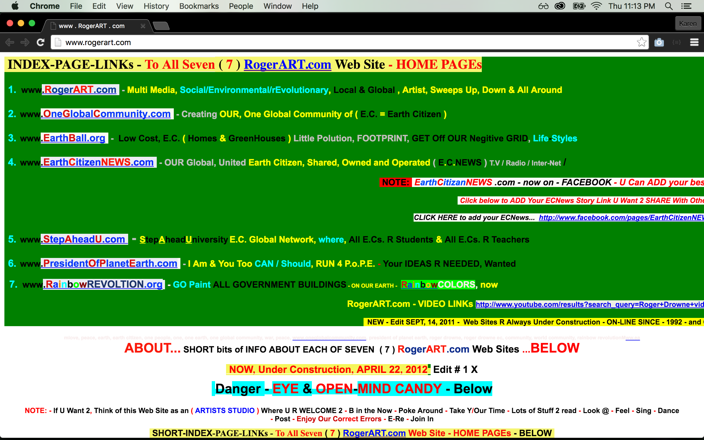
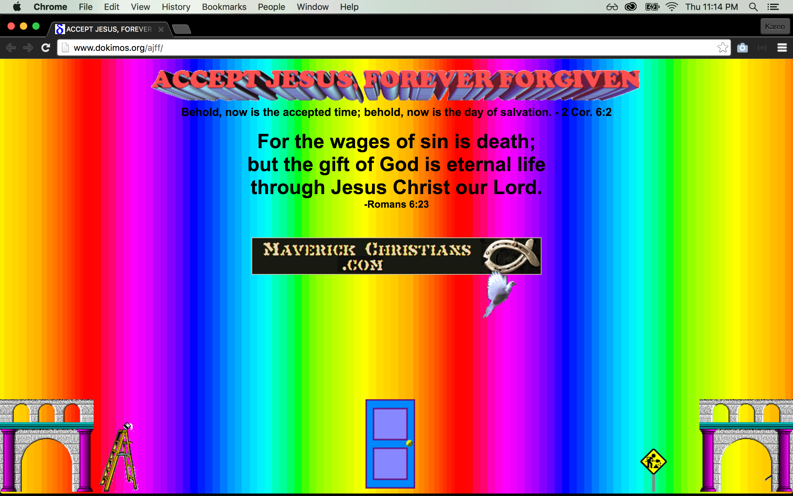
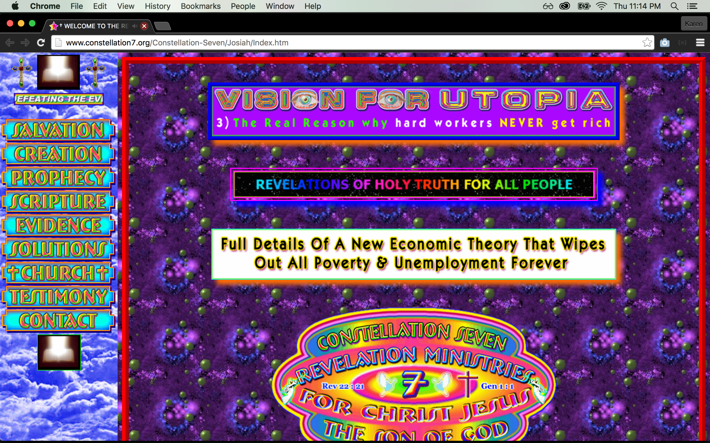
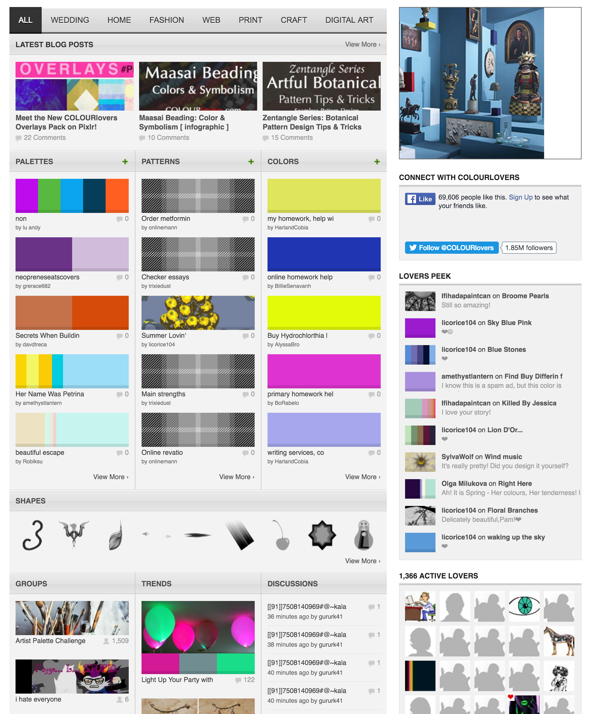
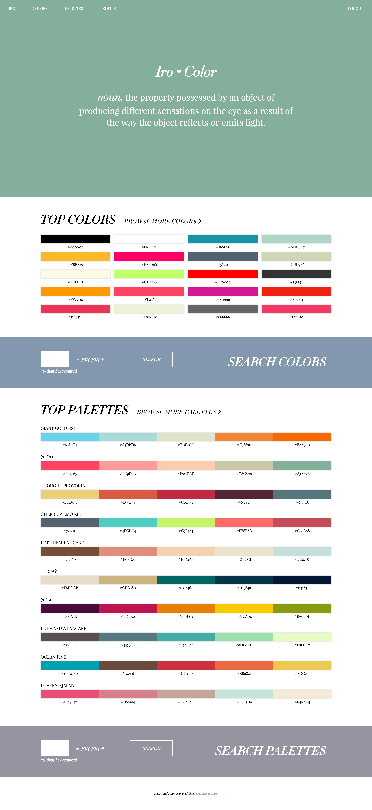

# Iro ("Color" in Japanese)

"Things aren't always #000000 and #FFFFFF." If you're a designer or a developer, you have probably heard that before, or can at least understand it. :) Colors play a crucial role in the success of a website; they can stimulate emotions, express messages, spark interest, and be the determining factor in whether or not users decide to stay on a website.

Examples of poor color choices:

##COLOURlovers
As a web developer, even though I have not been educated on color theory, I do try to make sure that the colors I select look good together, and are easy on the eyes. I usually like to browse color palettes that other people have made to give me ideas. There is one particular site, [colourlovers.com](http://colourlovers.com), that has over four million palettes made by its users! However, the site in itself is not solely devoted to colors and color palettes. They also have patterns, pattern templates, shapes, and so much more. It's actually a bit overwhelming for me to use because there is so much going on.

COLOURlovers home page:

##My Solution
I decided that I wanted to make a clean, simple app that would focus solely on colors and color palettes. COLOURlovers has a public API available, and I was able to make calls to grab colors and color palettes made by its users. My Iro app allows users to search for colors and palettes by their hex values, and if you sign up, you will be able to create custom color and color palette lists. :)

**Iro Home Page:**

##Technologies Used
- **MongoDB/Mongoose** ][ Database, Database wrapper
- **Express** ][ Node.js web application framework
- **AngularJS** ][ JavaScript framework
- **Node.js** ][ JavaScript runtime environment 
- **HTML** ][ Markup
- **CSS/Sass/Normalize.css** ][ Styling
- **JavaScript** ][ Core functionality
- **COLOURlovers API** ][ Color and color palette provider
- **Git/GitHub** ][ Code management
- **Heroku** ][ Deployment
- **mLab** ][ MongoDB hosting platform
- **JSON Web Token** ][ User authentication & authorization
- **Trello** ][ User story management

##Links
- [Iro](https://shrouded-wildwood-47469.herokuapp.com) ][ Deployed site
- [Trello](https://trello.com/b/xiHGx4jp/iro) ][ User stories

##Hurdles
This was my first MEAN stack application, so it took some time getting used to Angular, and not being able to use jQuery.

##Next Steps
- Add responsive styles
- Add HSL colors (hue, saturation, lightness)